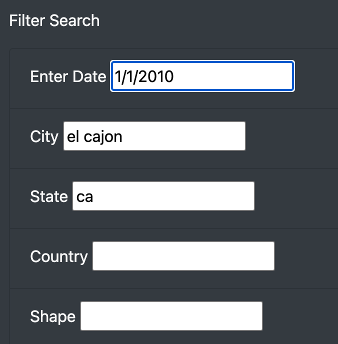
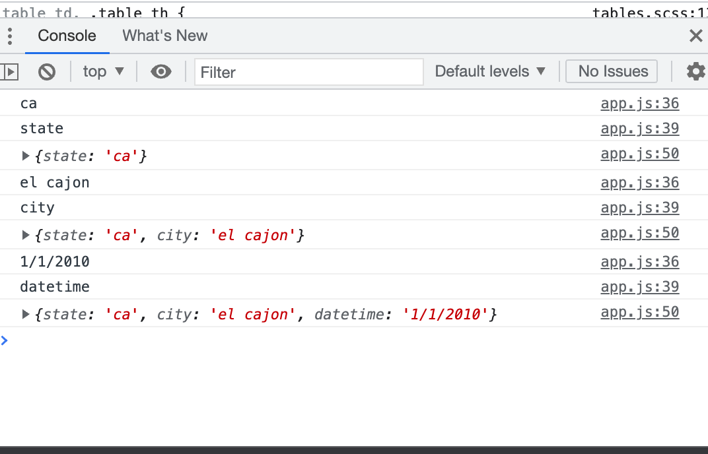

# UFO Sightings

## Overview of Project:
The goal of this prject was to compile information on purported UFO sightings into an easily read table. The aim was to add filters so that users can focus their search to specific regions or times. 

## Result
The full table contains 111 records of UFO sightings. That is too many for a person to sift through, especially if they are interested in a specific time or place. Adding filters will allow users to target their research. The data on the sightings include these specifics so we should use them to make our site as usable and intriguing to users as possible. 

#### Process
When a user changes the text in any of the text input boxes, the code will detect that change and store the information added. If text is added to other boxes, it will gather all of the filters into an object. If you delete the text in a box, it will remove that from the filters. 

Image of site filters with text added

Corresponding console results showing that the information has been gathered into an object

Then the code will loop through the stored filters, applying each, and only retaining the data from the table if the filters are met. 
Then an updated table is built. 

## Summary
Adding filters to the table on this webpage increases functionality for users, and also increases engagement.

#### Limitation
One drawback which users could find frustrating, is that in order to remove filters, you need to go into each text field and delete the existing text. 

#### Next steps
Our next development steps would include adding a button which would clear all filters and reset the table. 
Another helpful development would be to allow an individual to map the locations for the results of their search. Mapping sightings from the same day, might help a researcher identify sightings which reflect the same phenomenon. For example, many of the sightings for 1/1/2010 include references to 3 red lights. Several include 'El Cajon' in either the city or comment fields, but a map would demonstrate that the sightings in Spring Valley and National City were also likely the same phenomenon. 
